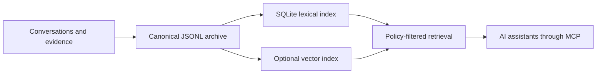

# Mindmory

> **Memory should belong to the person—not the model.**

Mindmory is a local-first memory and evidence layer for AI assistants. It gives
an assistant durable access to your preferences, decisions, corrections,
projects, and history—without making any model or vendor the owner of that
information.

**AI models are replaceable. Your memory is not.**

[](https://github.com/ycooi/mindmory/releases/latest)
[](https://github.com/ycooi/mindmory/actions/workflows/ci.yml)
[](LICENSE)
[](go.mod)

[Download Mindmory Lite](https://github.com/ycooi/mindmory/releases/latest) ·
[Agent installation guide](packaging/AGENT_INSTALL.md) ·
[MCP integrations](packaging/integrations/README.md)

## Why Mindmory exists

An AI model has a temporary working context. Product-managed memory can make
that context last longer, but it is often opaque, difficult to correct, and
locked to one provider. Asking a model to “remember everything” creates another
problem: guesses, stale details, and model errors can quietly become supposed
facts.

Mindmory treats personal memory as **user-owned infrastructure** and keeps three
concerns deliberately separate:

| Layer | Meaning |
| --- | --- |
| **Evidence** | What the person actually said or supplied |
| **Memory** | The structured claim derived from that evidence |
| **Retrieval** | How relevant, policy-eligible memories are selected |

An evidence hash proves where a memory came from; it does not pretend that the
statement is objectively true. Provenance stays visible, corrections remain
possible, and the model never becomes the authority.

> **The model may propose a memory. The memory system decides whether it may be
> stored, retrieved, or trusted.**

## How it works



- **Portable by design.** Human-readable JSONL is canonical and remains usable
  independently of a database, model, or vendor.
- **Fast without surrendering ownership.** SQLite is the complete read
  projection for search, recall, messages, and evidence. SQLite and persistent
  vector files can both be rebuilt from the canonical archive.
- **Lexical first.** Exact names, dates, identifiers, and preferences work
  without embeddings. Semantic search is optional when it proves useful.
- **Correctable history.** New records supersede outdated memories without
  erasing the evidence or the history of the change.
- **Model-independent.** The same memory can serve Codex, Claude Code, DSH, and
  other MCP-capable assistants.

## Why “Lite”

“Lite” describes the operational footprint, not the design. Mindmory Lite is a
single-owner service built as one Go process with JSONL, SQLite, and optional
embeddings. It requires no Docker, PostgreSQL, hosted vector database, or local
LLM. The result is a memory service that can be inspected, backed up, moved,
repaired, and understood by the person who owns it.

Current release: **0.1.1** (2026-08-29)<br>
Author: **OOI YC** · Organization: **KELE Research**

## What ships

| Binary | Purpose |
| --- | --- |
| `mindmoryd-lite` | Loopback HTTP daemon and canonical store |
| `mindmory-mcp-stdio` | MCP stdio bridge used by the assistant |
| `mindmoryctl` | Read-only status, integrity, and guarded operator actions |
| `mindmory-eval-lite` | Retrieval evaluation tool (source build only) |

The daemon exposes evidence-backed memory search, recall, context packets,
explicit remember/correct/forget proposals, feedback, operational status, and
startup incident reporting. MCP callers can read sanitized configuration and
statistics through `mindmory_status`; secrets and memory content are excluded.

## Requirements

- Go 1.26.6 or newer to build from source
- macOS or Linux for the supplied release targets
- An MCP-capable client

No Docker is used by the build, tests, or runtime.

## Build and test locally

```bash
make test
make test-race
make evaluate
make build
```

Native binaries are written to `bin/`. To build checksummed archives for
macOS and Linux on AMD64 and ARM64:

```bash
make release
```

## Minimal configuration

Mindmory reads configuration from the process environment. It does not load a
project `.env` file. Supply secrets through your service manager, shell,
keychain, or MCP host configuration.

```bash
export MINDMORY_OWNER='local-owner'
export MINDMORY_CURSOR_SIGNING_KEY='replace-with-at-least-32-random-characters'
export MINDMORY_ADMIN_TOKEN='replace-with-at-least-24-random-characters'
export MINDMORY_MCP_CLIENT_TOKENS_JSON='{"local-agent":{"token":"replace-with-at-least-24-random-characters","capabilities":["CONTEXT_READ","ARCHIVE_CHECKPOINT","MEMORY_PROPOSE","ARTIFACT_SEARCH","ARTIFACT_READ","RESOURCE_READ","OPS_READ"]}}'
export MINDMORY_LOCAL_CLIENT_KEY='local-agent'
export MINDMORY_EMBED_PROVIDER='disabled'
export MINDMORY_SEMANTIC_SEARCH='0'
./bin/mindmoryd-lite
```

Experimental steady-state RAM reduction can be enabled with
`MINDMORY_LOW_RAM_EXPERIMENT=1`. It serves complete records from SQLite and
releases archive-sized Go maps after startup. Startup still temporarily
materializes canonical JSONL, so this is not yet the default.

The default bind is `127.0.0.1:58080`. Keep it on loopback. Administrative
routes always require `MINDMORY_ADMIN_TOKEN`; set `MINDMORY_AUTH=token` to
require bearer authentication for model-facing routes too.

## Storage layout

Paths are configurable and relative to `MINDMORY_ROOT_DIR` unless absolute.

| Variable | Default | Role |
| --- | --- | --- |
| `MINDMORY_DATA_DIR` | `var/data` | Canonical JSONL authority data |
| `MINDMORY_DERIVED_DIR` | `var/derived` | Rebuildable SQLite index |
| `MINDMORY_VECTOR_DIR` | `var/derived/vectors` | Rebuildable vector generations |
| `MINDMORY_SNAPSHOT_DIR` | `var/data/snapshots` | Integrity-checked snapshots |
| `MINDMORY_EXPORT_DIR` | `var/export` | Import/export exchange |

Canonical data may not overlap derived or vector directories. Runtime state
under `var/` is ignored by Git and excluded from release archives.

## Optional embeddings

Lexical retrieval is the default and works without an embedding model.

- `MINDMORY_EMBED_PROVIDER=disabled`: no embeddings.
- `MINDMORY_EMBED_PROVIDER=ollama`: local Ollama-compatible endpoint.
- `MINDMORY_EMBED_PROVIDER=openai-compatible`: external embeddings endpoint.

Remote embeddings require HTTPS, `MINDMORY_EMBED_ALLOW_REMOTE=1`, an API key,
and an explicit stable `MINDMORY_EMBED_MODEL_DIGEST`. Remote providers receive
memory and query text, so enabling them is a deliberate privacy decision.

When provider, model, digest, dimensions, or embedding format changes, startup
detects the mismatch, disables semantic retrieval, and reports an actionable
incident through logs and MCP. Canonical memory remains usable. Follow the
incident-bound instructions shown by `mindmory_status`, for example:

```bash
export MINDMORY_ADMIN_ENDPOINT=http://127.0.0.1:58080
export MINDMORY_ADMIN_TOKEN='your-admin-token'
./bin/mindmoryctl vectors status
./bin/mindmoryctl vectors rebuild --incident-id inc_FROM_STATUS --confirm
```

The new generation is built separately and becomes current only after full
verification; a failed rebuild leaves the prior generation intact. Keep
`MINDMORY_SEMANTIC_SEARCH=0` unless evaluation with real queries shows a
measurable quality benefit.

## MCP setup

For a packaged installation, run the agent-safe setup and register only the
stdio command in your MCP client:

```bash
./setup.sh --agent --complete-mcp
```

The bridge discovers the protected `mindmory-config.sh` beside the package, so
tokens do not need to appear in agent configuration. If setup is missing or
invalid, the MCP process still connects in restricted bootstrap mode with only
`mindmory_status`; discovery or the first call returns a copy-and-paste setup
command and quarantines ordinary memory tools. Credentials are never returned
through MCP.

Release archives also include `integrations/codex/`,
`integrations/claude-code/`, and `integrations/generic/`. Codex and Claude Code
packages include a `UserPromptSubmit` checkpoint hook so evidence-backed
remember, correct, and forget operations can bind to the exact current prompt.

## Documentation and project policy

- Operational recovery: [docs/lite/HARDENING_AND_RECOVERY.md](docs/lite/HARDENING_AND_RECOVERY.md)
- Retrieval experiment: [docs/lite/SEMANTIC_RETRIEVAL_EXPERIMENT_2026-08-27.md](docs/lite/SEMANTIC_RETRIEVAL_EXPERIMENT_2026-08-27.md)
- SQLite read architecture: [docs/lite/SQLITE_READ_PROJECTION.md](docs/lite/SQLITE_READ_PROJECTION.md)
- Release process: [RELEASING.md](RELEASING.md)
- Security reporting: [SECURITY.md](SECURITY.md)
- Contribution guide: [CONTRIBUTING.md](CONTRIBUTING.md)

Copyright OOI YC and KELE Research. Licensed under the [MIT License](LICENSE).
Complete upstream terms for modules compiled into release binaries are indexed
in [THIRD_PARTY_NOTICES.md](THIRD_PARTY_NOTICES.md) and reproduced in
`THIRD_PARTY_LICENSES.txt`.
